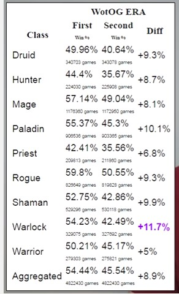
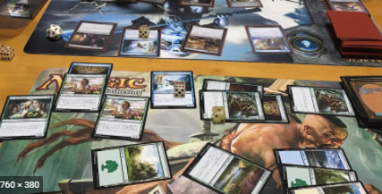

# 게임 밸런스란?

_게임에서 사용할 숫자를 파악하는것._

술레잡기에 게임 밸런스라는 개념이 있을까?  
https://en.wikipedia.org/wiki/Tag_%28game%29

실제 숫자를 가지고 있음  
각 플레이어가 얼마나 빨리 달리수 있는지  
얼마나 오래 뛸수 있는지  
서로 얼마나 가까이 있는지 
플레이 영역의 크기  

술레잡기는 스포츠가 아니기 때문에 통계를 추적하지 않는다 

## 게임이 균형을 이루고 있는지 어떻게 알수 있을까?

수천년동안 플레이된 체스 조차 완전하지 않다. 
먼저 시작하는것이 약간의 이점이 있다는것이 관찰되었다. 
플레이어 스킬이 높을수록 게임의 균형은 맞지 않는다.  

하스스톤도 마찬가지 

Catan을 예를 들어보자 
https://www.youtube.com/watch?v=37V2ajpMEic  
게임의 대부분은 다른 플레이어와 거래 자원 중심으로 이루어진다 
한명의 플레이어가 약간의 플레이 이점이 있을 경우 다른 플레이어는 해당 플레어와 한동안 거래를 하지 않을수 있다.  
이는 캐주얼 게임에서는 발생하지 않는데 플레이어는 게임 초반에 약간의 이점을 인식 할수 없기 때문이다  
그러나 토너먼트 수준에서 플레이어는 게임에서 내재된 불균형을 발견하고 그 행동을 따라 행동할 가능성이 더 높다. 

### "게임 밸런스는 쉽지 않거나 명백한 작업이 아니다."

<strong>결정적과 비결정적 속성</strong>  

<em>결정적</em>

게임을 주어진 게임상태로 시작하고 <em>특정 작업</em>을 수행하면 항상 동일한 결과로 <em>새로운 게임 상태</em>를 생성하는 게임으로 정의 한다.  

체스, 바둑, 장기 모두 결정적이다  

포커는 비결정적이다.  
상대방의 카드가 무엇인지 모르기 때문에 핸드의 실제 결과가 다를수 있다.  

가위바위보는 비결정적이다.</strong>
상대의 행동에 따라 때로 이기고, 지고, 무승부 한다는점에서 결정적이지 않다. 

<em>비결정적</em>

아케이드 클래식 Pac-Man과 후속편 Ms. Pac-Man을 비교해보자 
pac-man: https://en.wikipedia.org/wiki/Pac-Man 
ms. pac-man: https://www.youtube.com/watch?v=HQv0zAXDCo8

원래 pac-man은 완전히 결정적이다 
유령은 순전히 현재 게임 상태에 의존하는 AI를 따른다  
결과적으로 주어진 레벨에 미리 정의된 컨트롤러 입력 시퀀스를 따르면 항상 똑같은 결과가 생성된다. 
이 결정적 속성때문에 일부 플레이어는 움직임 패턴을 파악할수 있었다. 
게임은 쫒기고 쫒는것에서 패턴을 암기하고 실행하는것으로 바뀌었다.  

메탈슬러그 : https://www.youtube.com/watch?v=NXR5FKpUyng   또한 결정적이다.  

<em>옜날오락실 게임은 거의 결정적속성을 가지고 있었다.</em>

아케이드 게임은 수익을 유지 하기 위해 플레이어가 평균 3분 이하로 플레이 해야 했다.  

패턴 플레이어는 몇시간동안 플레이를 할수 있었다  

미스 팩맨에서는 결국 비결정적 요소를 추가 했다 
때로 귀신이 무작위로 자신의 방향을 선택 한다  
그 결과 미스 팩맨은 게임 플레이의 초점을 <em>패턴 실행</em>에서 <em>빠른 사고와 반응</em>으로 되돌렸고 클래식 팩맨과 미스팩맨은 상당히 다르게 플레이되었다.  

 

 

비결정적 속성의 게임이 더 좋다는 말은 아니다  
한 방법이 다른 방법보다 우월하다라는것이 아니라 결정적과 비결정적 속성 게임에 대해 게임 밸런스 분석이 다르게 수행된다는 점이다.  

결정적 속성 게임은 이론적으로 어떤 종류의 무차별 대입 분석을 거쳐 가능한 모든 동작을 보고 가장 좋은 동작을 결정한다. 
고려해야할 이동 수가 너무 많아 (ex: 바둑) 무차별 대입 해결이 불가능할수 있지만, 적어도 일부의 경우(게임 초반 위치, 종료 위치) 약간의 수를 할수 있다  

<em>해결 가능성</em> 
게임이 일방적인 해결 가능한 경우 게임에는 특정 시점에서 취할수 있는 "최상의 액션"이 있으며 플레이어가 그 움직임이 무엇인지 알수 있는 것이다. 
일반적으로 일방적인 해결 가능성은 게임에서 바람직하지 않은 특성이다. 
플레이어가 최선의 움직임을 안다면 흥미로운 결정을 내리지 못하기 때문이다 
즉, 많은 종류의 해결 가능성이 있어야 한다  

<em>이론적 완전한 융해성</em>
이론적으로 해결 할 수 있는 체스나 바둑과 같은 게임이 있지만 실제로 인간의 마음이 전체 게임을 현실적으로 해결할수 없는 순열이 너무 많다  
게임의 복잡성이 우리가 해결할수 있는 능력을 넘어서기 때문에 게임이 해결 가능하지만 여전히 흥미로운 경우가 있다 

_"게임이 균형을 이루고 있는지는 말하기는 어렵다."_  

실제로 해결책을 알지 못하고 실제로 해결할 수단이 없기 때문이다. 
그러나 우리는 게임이 균형을 이루고 있는지에 대한 좋은 추측을 얻기 위해 게임 디자이너의 직관, 숙련된 플레이어의 의견 또는 많은 챔피언쉽 수준 게임의 토너먼트 통계에 의존해야 한다. 

<em>비 결정적 게임 해결</em> 
비결정적 게임은 무작위 적이거나 알려지지 않은 요소를 가지고 있음으로 "최적" 플레이가 승리를 보장하지 않는다. 

그러나 비결정적 게임은 여전히 해결될수 있다고 생각한다  
솔루션이 많이 다르게 보일뿐이다  
이경우 솔루션은 승리확률을 극대화 하는 일련의 작업이다. 

 
 

 
포커게임은 플레이어의 손에 있는 카드와 테이블에 보여지는 카드에 대한 정보를 가지고 있다  
이러한 정보로 플레이어는 손 패로 이길 확률을 정확하게 계산할수 있다. 
실제로 챔피언쉽 선수들은 이것을 실시간으로 할수 있다. 

<em>심리적 요인</em> 

공격적으로 배팅 하는 다른 플레이어는 좋은 손패를 가졌을까? 
아니면 그의 손패가 실제로 낫다고 생각하도록 속이는가? 

이처럼 숙련된 심리적 플레이를 하는 순간 행운(운빨) 게임으로 바뀔수도 있다. 

<em>비타협적 게임 해결</em> 

가위 바위 보 게임은 당신과 상대방 사이의 동시 선택에 승패가 달려있다. 
가위 바위 보 게임에 대한 해결책은 1:1:1 비율이다  
상대방의 한 가지 유형을 다른 유형보다 더 많다면 선호하는 유형의 비율을 생각해 약간 더 많이 이길수는 있을것이다. 
솔루션은 장기적으로 동일한 빈도로 각 유형을 내는것이다.  

<em>완벽한 정보</em> 

해결 가능성과 관련된 개념은 정보 가용성이다. 
완벽하거나 완전한 정보가 있는 게임에서 모든 플레이어는 항상 게임 상태의 모든 요소를 알고 있다. 
이것은 체스와 바둑같은 게임이다. 

완벽한 정보를 가진 결정론적 게임이 적어도 이론적으로는 완전히 풀수있다는것을 알수 있다. 

포커 같은 카드 게임은 각 플레이어가 전체 게임 상태를 알지 못한다  
모든 플레이어에게 숨겨진 정보가 있다.  
_Rummy_ 게임은 모든 플레이어는 바닥 카드 (공통정보)에 무엇이 있는지 알고 있고 각 플레이어는 자신의 손에 무엇이 있는지 알고 있지만 다른사람 손(특권 정보)는 알지 못한다. 
또한 뽑기 덱에 남아 있는 카드는 아무도 모른다 (숨겨진정보)  

<em>대칭과 비대칭</em> 

게임 밸런스에 영향을 미치는 또 다른 개념은 게임이 대칭인지 비대칭인지 여부다. 
대칭 게임은 모든 플레이어가 정확히 동일한 시작 위치와 동일한 규칙을 갖는 게임이다. 

완벽하게 대칭적인 게임은 자동으로 규형을 이룬다고 할수 있다. 
시작 위치가 똑같기 때문에 처음부터 장단점이 없다. 
하지만 게임 내에 게임 개체나 전략이 균형을 이루는것을 보장할수는 없다. 
완벽한 대칭은 디자이너가 균형 잡힌 게임을 만드는 쉬운방법이 아니다 

<em>메타 게임</em> 

 
\ 

메타 게임 이라는 용어는 문자 그대로 "게임을 둘러싼 게임"을 의미한다.  
이것은 게임의 규정 된 규칙을 초월하거나 운영하는 게임에 대한 접근 방식, 외부 요인을 사용하여 게임에 영향을 미치거나 게임에 의해 설정된 가정 또는 한계를 넘어서는 것이다  
트레이딩 카드 게임 은 게임 사이에 플레이어가 덱을 구성하고 해당 덱의 내용이 승리 능력에 영향을 미칩니다.  

ex) 하스스톤 파워 덱 (n티어), 보상 시스템 

게임의 한 부분에서 발생하는 게임 밸런스 문제가 다른 영역으로 전파되고 나타날 수 있으므로 플레이 테스트 중에 나타나는 문제가 항상 수정해야 할 정확한 문제는 아니라는 것을 알아야 한다.  
불균형을 식별 할 때 문제를 해결하기 전에 이 불균형이 실제로 발생하는 _이유와 원인이 무엇인지_ 최대한 깊이 생각해야 할것이다.

